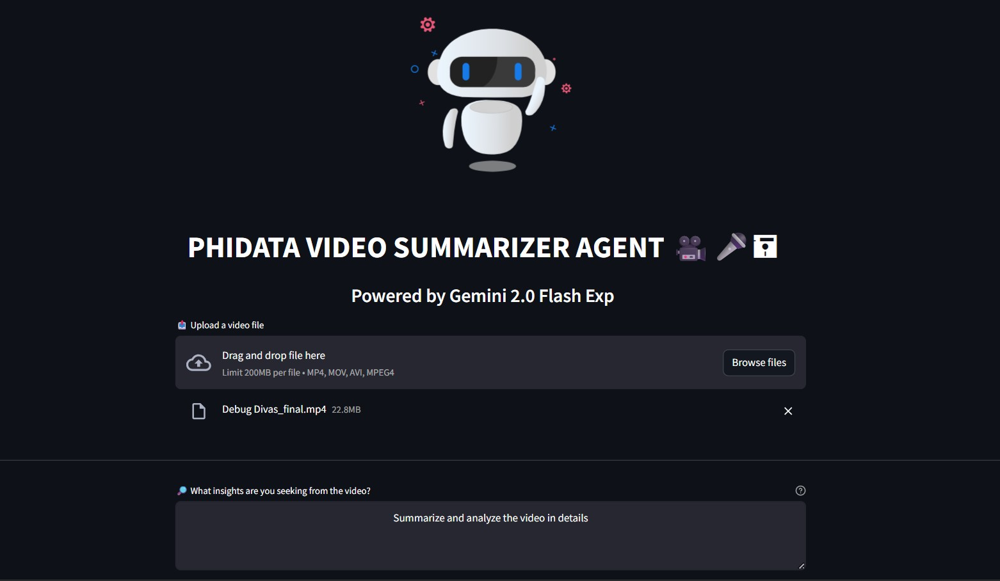
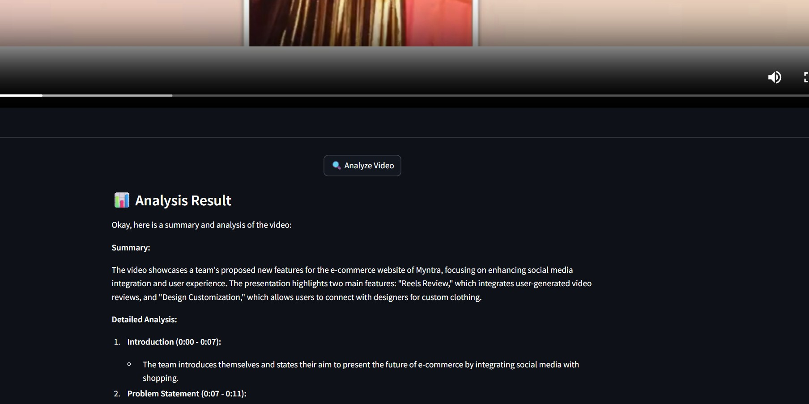

# Agentic-AI-Video-Summarizer
A video summarizer powered by Gemini and Phidata to analyze the video and give an in-depth summary with the added insights of the video using the advance power of Agentic AI.

Languages and tool used are: 
[](https://skillicons.dev)


## 🎥Live At:
https://agentic-ai-video-summarizer.streamlit.app/


## 🚀 How to Run Locally
### 1️⃣ Clone the Repository
```bash
git clone https://github.com/your-username/Agentic-AI-Video-Summarizer.git
cd Agentic-AI-Video-Summarizer
```

### 2️⃣ Create a Virtual Environment
```bash
python -m venv env
source env/bin/activate  # For Mac/Linux
env\Scripts\activate    # For Windows
```

### 3️⃣ Install Dependencies
```bash
pip install -r requirements.txt
```

### 4️⃣ Run the Application
```bash
streamlit run Summarizer.py
```

### Screenshots


